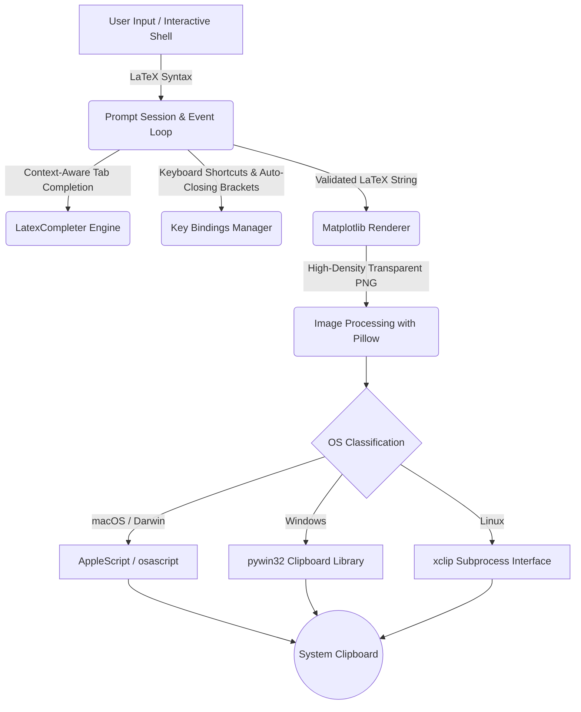

# Mathclip


Mathclip is an interactive command-line utility designed to bridge the gap between LaTeX mathematical notation and modern document editors. By parsing input expressions, rendering them at high density, and placing the resulting graphic directly onto the host platform clipboard, the tool allows you to quickly generate math assets for documents, spreadsheets, and team collaboration applications.

## Technical Architecture

The following diagram illustrates the flow of input from the interactive shell, through the compilation and rendering pipelines, to platform-specific clipboard dispatch systems.



## System Capabilities

Mathclip coordinates several internal systems to provide an integrated editor environment within your terminal. The interface relies on a customized prompt loop that evaluates input dynamically. Instead of requiring users to remember complex LaTeX command syntax, a completion engine offers real-time suggestions and templates for multi-part constructs such as matrices, fractions, and square roots. To support fluid typing, the custom key configuration manages automatic bracket closure and introduces a navigation shortcut using `Ctrl + Space` to move between expression placeholders.

Once you submit a completed expression, the application passes the string to a rendering pipeline built on Matplotlib. The renderer configures the canvas with a transparent background, applies Computer Modern font spacing, and computes the exact bounding box of the text. This dynamic calculation keeps padding minimal and ensures the output matches the boundaries of the mathematical text. The system outputs a high-resolution PNG image set to 300 DPI, maintaining clean legibility when scaled inside destination documents.

The final stage of the application workflow involves platform integration. Because clipboard protocols vary by operating system, the application detects the host environment and uses target-specific methods to write the raw bytes. On macOS, the program manages a temporary asset and executes AppleScript instructions to bind the image to the clipboard. On Windows, the utility uses native API bindings to populate the clipboard with both raw PNG data and Device-Independent Bitmap formatting. On Linux, the tool pipes the binary data directly to active clipboard selections.

## Usage and Interface Controls

To start the interactive command line, execute the main entry point:

```sh
python -m mathclip.main
```

The utility offers several color rendering options using standard command-line flags. Users can configure the session output by launching the tool with specific parameters. The `-w` or `--white` flag renders the formula in white, the `-r` or `--red` flag outputs in red, the `-b` or `--blue` flag outputs in blue, and the `-g` or `--green` flag produces a green rendering. When no flag is specified, the application defaults to rendering text in black.

To generate a graphic, type your desired LaTeX expression at the prompt and press Enter. The utility will compile the equation, update the system clipboard, and print a confirmation message. To terminate the active session and return to your system shell, type `exit` or `quit` at the prompt.


## Installation and Setup

The project is packaged for compatibility with modern Python package management tools. If you use the `uv` package manager, you can install the environment and synchronize dependencies using the synchronization command:

```sh
uv sync
```

To install the executable tool globally within your local environment, run the tool installation command:

```sh
uv tool install .
```

### Linux Dependencies

Linux installations require the `xclip` utility to handle system clipboard interactions. If you are operating on an Ubuntu or Debian system, you can obtain this package through your standard software manager:

```sh
sudo apt install xclip
```
